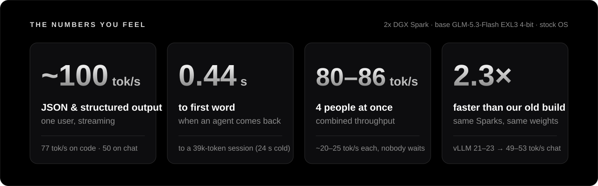

<p align="center">
  
</p>

Run **GLM-5.3-Flash** on two NVIDIA DGX Sparks as a fast, keyed, OpenAI-compatible endpoint for your developers and
agents. One command builds it on top of [jayleaton/glm53-tensorfold-spark](https://github.com/jayleaton/glm53-tensorfold-spark)
(the [TensorFold](https://github.com/ashhart/TensorFold) engine plus 77 patches) with the settings we run in production.

<p align="center">
  
</p>

## Install

On the head Spark (two Sparks cabled CX7 to CX7, Docker on both, passwordless ssh to the worker, ~400 GB free a node):

```bash
curl -fsSL https://raw.githubusercontent.com/TechGuardCoders/glm53-tensorfold-spark-recipe/main/install.sh | bash -s -- --worker <user>@<worker CX7 IP>
```

Add `--dflash2` for the DFlash2 drafter (faster code and JSON; **non-commercial licence**, read it first). Add
`--dry-run` to check both nodes and see the plan without changing anything. The first run builds the engine image and
downloads 176 GB of weights a node (~1-2 h), then prints your endpoint and API key:

```text
endpoint   http://<head>:8000/v1      model   glm-5.3-flash      API key   ~/.config/glm53/api-key
```

## What you get

| | |
| --- | --- |
| **Speed** | 49-53 tok/s chat, 77 tok/s code, 90-109 tok/s JSON and structured output, 62-122 tok/s agent file edits (one user) |
| **Concurrency** | 4 requests at once, 80-86 tok/s combined; 4 conversations of 250k tokens each fit (~15 GB of memory to spare) |
| **Agents** | revisited sessions start in 0.44 s (prefix cache); tool calls 105/105 clean on the opencode harness |
| **Context** | up to 1,048,576 tokens, shared by the 4 slots |
| **Quality** | MMLU-200 89.0%; drafted output identical to serial decoding (10/10) |
| **Ops** | Bearer-key proxy, model id `glm-5.3-flash`, restart in ~1.5 min, health signals for a watchdog |

**This recipe or MiaAI's?** We ran [MiaAI's TensorFold recipe](https://github.com/MiaAI-Lab/GLM-5.3-Flash-EXL3-2x-DGX-Sparks-TensorFold)
in production on the same Sparks and came back. It is 15-19% faster with 4 requests at once and about 10% faster on
one. Here, though, an agent returning to a 21k-token conversation after the server served another one starts in
0.5 s, against 10 s there. Busy parallel traffic: Mia's. Many agents taking turns: this one. Side-by-side numbers and
a test for your own traffic: [docs/VS-MIA.md](docs/VS-MIA.md).

Every number, with method and raw data: [docs/EVALS.md](docs/EVALS.md). What we changed from upstream and why:
[docs/HOW-IT-WORKS.md](docs/HOW-IT-WORKS.md). What we try next: [docs/OPTIMIZATION-ROADMAP.md](docs/OPTIMIZATION-ROADMAP.md).

<details>
<summary><b>The one setting most people miss</b></summary>

If your client sends no `temperature`, the model's default of 1.0 applies, and TensorFold only drafts with DFlash2 on
greedy (temperature 0) requests. Most agent frameworks send none. This recipe starts the server with
`--temperature=0` as the default: 4.36 -> 5.73 tokens a step, ~68 -> ~83 tok/s for those requests. Clients that set a
temperature keep theirs. ([details](docs/EVALS.md#e-the-default-temperature-trap))
</details>

## Credits

This is a thin layer on other people's work. Thank you:

- **[jayleaton / glm53-tensorfold-spark](https://github.com/jayleaton/glm53-tensorfold-spark)**: the patches, production
  config, launcher and benchmark clients. Everything that makes this fast is theirs.
- **[Ash Hart / TensorFold](https://github.com/ashhart/TensorFold)** and contributors: the engine.
- **[Brandon M. Music / ShapleyMcg](https://github.com/brandonmmusic-max/shapleymcg)**: the GLM-5.3-Flash TR3 4-bit EXL3
  weights ([brandonmusic/GLM-5.3-Flash-tr3-4bpw](https://huggingface.co/brandonmusic/GLM-5.3-Flash-tr3-4bpw)), with the
  Local Inference Lab contributors credited on that card for the runtime foundation.
- **[incoai](https://huggingface.co/incoai/GLM-5.3-Flash-DFlash2)**: the DFlash2 drafter ([DFlash](https://github.com/z-lab/dflash)).
- **[Z.ai](https://huggingface.co/zai-org/GLM-5.3-Flash)**: GLM-5.3-Flash. **[turboderp / ExLlamaV3](https://github.com/turboderp-org/exllamav3)**: EXL3.
- **[Entrpi](https://github.com/Entrpi/vllm-glm-5.3-flash-spark)**, **[MiaAI-Lab](https://github.com/MiaAI-Lab/GLM-5.3-Flash-EXL3-2x-DGX-Sparks)**
  and **[Reederey87](https://github.com/Reederey87/glm53-flash-exl3-2x-dgx-spark)**: the 2x Spark vLLM work this grew
  from (our "before" numbers are Entrpi's fork).
- **[local-inference-lab/b12x](https://github.com/local-inference-lab/b12x)**, **[kindlingai](https://github.com/kindlingai/glm-5.3-flash-gx10)**,
  **[mlc-ai/xgrammar](https://github.com/mlc-ai/xgrammar)**, **[neko-legends](https://huggingface.co/neko-legends)**,
  NVIDIA, [vLLM](https://github.com/vllm-project/vllm), [Caddy](https://caddyserver.com) and Hugging Face.

## Licensing

- **This repo:** Apache-2.0 ([LICENSE](LICENSE), [NOTICE](NOTICE)). It downloads and configures the engine; it ships
  no upstream code and no weights.
- **Engine:** glm53-tensorfold-spark is Apache-2.0; TensorFold is MIT.
- **DFlash2** (`--dflash2` only): CC BY-NC-ND 4.0, non-commercial, no derivatives.
- **Weights:** [ShapleyMcg License v1.0](https://github.com/brandonmmusic-max/shapleymcg/blob/main/LICENSE), which
  requires this notice:

  > This work includes or was produced using ShapleyMcg, created by Brandon M. Music
  > (https://github.com/brandonmmusic-max/shapleymcg). ShapleyMcg is licensed under the ShapleyMcg License v1.0, an
  > attribution-required license that grants no rights to the person known as "0xSero." Use of ShapleyMcg without this
  > attribution is unlicensed.

<p align="center"><a href="https://techguard.io"></a><br>
<sub>Recipe, ops scripts and measurements by <a href="https://techguard.io">Tech Guard LLC</a>, Virginia.</sub></p>
